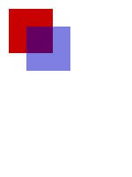

# Using JSDOM + webpack + Mocha + Vue.js + Canvas

This is a continuation of the [previous example](https://github.com/jhaynie/example-vue-jsdom) which expands unit testing to add support for unit testing images rendered from a <canvas> (all server side).

You should read the README for this project for more background on how to setup the project and details behind it.

## Usage

	npm install (or yarn install)
	npm test

You should be able to install your dependencies and then run an example test case using Mocha.

## Explanation of what's happening

This example project adds basic Mocha + webpack + JSDOM + Vue.js testing of server side Vue components but adds the ability to test canvas / image based rendered components and image diffing.

The Vue component basically renders the following to an HTML canvas:

The image diffing is performed with the node library [image-diff](https://github.com/uber/image-diff).

This also provides a basic example of how you can server-side render canvas or image based UI component.  This could be useful for sending HTML based emails that are dynamically generated, etc.

See the example test case to understand the logic at [src/test/test.js](src/test/test.js).

NOTE: a slightly modifying test command than the previous project.  This project uses a custom [register file](register.js) to opt-in image loading from the JSDOM which is by default off.

## Author

Jeff Haynie @jhaynie

## License

MIT. Pull requests encouraged and welcome.
